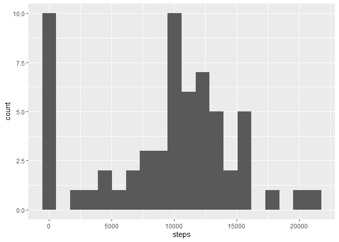
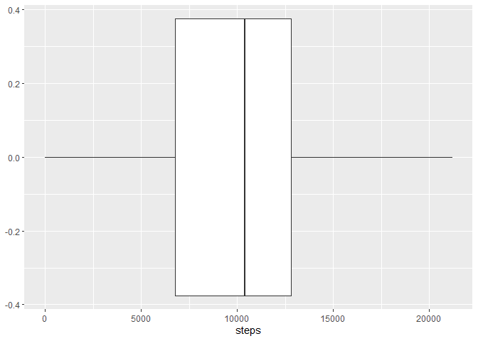
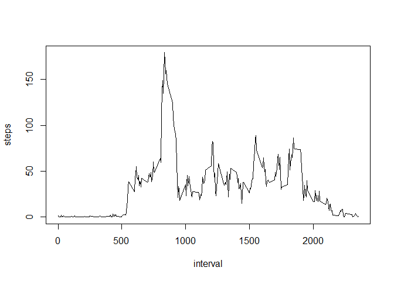
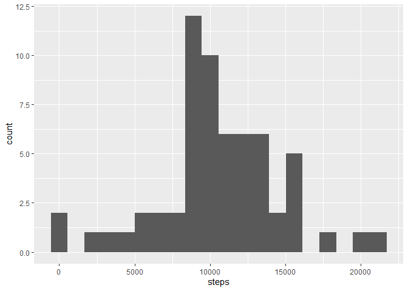
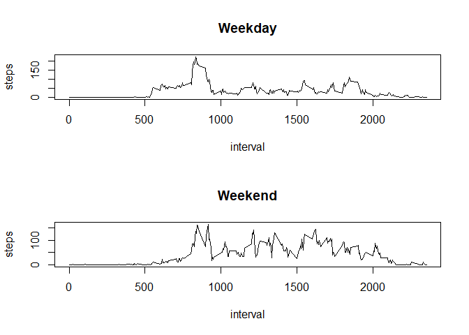

This document was created as part of the Reproducible Reserarch's courser, avaible at Coursera: https://www.coursera.org/learn/reproducible-research/

In this assessment I will need to address the folowing questions:

  1. What is mean total number of steps taken per day?
  2. What is the average daily activity pattern?
  3. Are there differences in activity patterns between weekdays and weekends?

My grade will be influenced by:

1. Commit containing full submission
2. Code for reading in the dataset and/or processing the data
3. Histogram of the total number of steps taken each day
4. Mean and median number of steps taken each day
5. Time series plot of the average number of steps taken
6. The 5-minute interval that, on average, contains the maximum number of steps
7. Code to describe and show a strategy for imputing missing data
8. Histogram of the total number of steps taken each day after missing values are imputed
8. Panel plot comparing the average number of steps taken per 5-minute interval across weekdays and weekends
10. All of the R code needed to reproduce the results (numbers, plots, etc.) in the report

## Packages Used
If you do not have those packages, use install.packages("packagename"). I´m using lubridate because `weekdays()` function returns days in my local language. Lubridate can give the weekday as a number. I think that it is more reproductible.


```r
library(dplyr, warn.conflicts = F, quietly = T)
library(ggplot2, warn.conflicts = F, quietly = T)
library(lubridate, warn.conflicts = F, quietly = T)
```


## Loading and preprocessing the data
The data is in the "activity.zip" file. To read it as a CSV, first I uncompressed it, then I loaded the uncompressed file "activity.csv":
the file:


```r
  unzip("activity.zip")
  activity = read.csv("activity.csv")
```

Before answering, lets take a look on the data. I like to look at the head, tail and summary:


```r
head(activity)
```

```
##   steps       date interval
## 1    NA 2012-10-01        0
## 2    NA 2012-10-01        5
## 3    NA 2012-10-01       10
## 4    NA 2012-10-01       15
## 5    NA 2012-10-01       20
## 6    NA 2012-10-01       25
```

```r
tail(activity)
```

```
##       steps       date interval
## 17563    NA 2012-11-30     2330
## 17564    NA 2012-11-30     2335
## 17565    NA 2012-11-30     2340
## 17566    NA 2012-11-30     2345
## 17567    NA 2012-11-30     2350
## 17568    NA 2012-11-30     2355
```


```r
summary(activity)
```

```
##      steps            date              interval     
##  Min.   :  0.00   Length:17568       Min.   :   0.0  
##  1st Qu.:  0.00   Class :character   1st Qu.: 588.8  
##  Median :  0.00   Mode  :character   Median :1177.5  
##  Mean   : 37.38                      Mean   :1177.5  
##  3rd Qu.: 12.00                      3rd Qu.:1766.2  
##  Max.   :806.00                      Max.   :2355.0  
##  NA's   :2304
```
Ok, everything is as I expected. Except the date, that was read as characters. How many dates we have?

```r
# unique_days will have a vector with all the dates in the data.frame
unique_days = unique(activity$date)

# length will tell us how many elements are in unique_days, i.e. the number of unique dates we have:
length(unique_days)
```

```
## [1] 61
```

Ok. Which ones?

```r
unique_days
```

```
##  [1] "2012-10-01" "2012-10-02" "2012-10-03" "2012-10-04" "2012-10-05"
##  [6] "2012-10-06" "2012-10-07" "2012-10-08" "2012-10-09" "2012-10-10"
## [11] "2012-10-11" "2012-10-12" "2012-10-13" "2012-10-14" "2012-10-15"
## [16] "2012-10-16" "2012-10-17" "2012-10-18" "2012-10-19" "2012-10-20"
## [21] "2012-10-21" "2012-10-22" "2012-10-23" "2012-10-24" "2012-10-25"
## [26] "2012-10-26" "2012-10-27" "2012-10-28" "2012-10-29" "2012-10-30"
## [31] "2012-10-31" "2012-11-01" "2012-11-02" "2012-11-03" "2012-11-04"
## [36] "2012-11-05" "2012-11-06" "2012-11-07" "2012-11-08" "2012-11-09"
## [41] "2012-11-10" "2012-11-11" "2012-11-12" "2012-11-13" "2012-11-14"
## [46] "2012-11-15" "2012-11-16" "2012-11-17" "2012-11-18" "2012-11-19"
## [51] "2012-11-20" "2012-11-21" "2012-11-22" "2012-11-23" "2012-11-24"
## [56] "2012-11-25" "2012-11-26" "2012-11-27" "2012-11-28" "2012-11-29"
## [61] "2012-11-30"
```

While working on the questions, I saw the need to process the data.

* For the __What is mean total number of steps taken per day__ question:

```r
per_day <- dplyr::group_by(activity, date)
# It shows a message on the version that I´m using( dplyr 1.0.0)
per_day <- dplyr::summarise(per_day, steps = sum(steps, na.rm=T))
```
* For the __What is the average daily activity pattern?__:

```r
per_day_interval <- dplyr::group_by(activity, interval, date)
per_day_interval <- dplyr::summarise(per_day_interval, steps = sum(steps, na.rm=T)) 

averages_per_interval <- dplyr::group_by(per_day_interval, interval)
averages_per_interval <- dplyr::summarise(averages_per_interval, steps=mean(steps))
```

## What is mean total number of steps taken per day?
Now I'm confident that I know the data enought to start working on this question. To be sure of the meaning of the question, I came back to the [Coursera Page](https://www.coursera.org/learn/reproducible-research/peer/gYyPt/course-project-1) and extracted the content that explains it:
    
    What is mean total number of steps taken per day?
    For this part of the assignment, you can ignore the missing values in the dataset.
    
    Calculate the total number of steps taken per day
    If you do not understand the difference between a histogram and a barplot, research the difference between them. Make a histogram of the total number of steps taken each day
    Calculate and report the mean and median of the total number of steps taken per day

So it seems that I have to use plots to do it. Let´s begin with the Histogram:

```r
ggplot2::ggplot(per_day, ggplot2::aes(x=steps)) + ggplot2::geom_histogram(bins=20)
```

<!-- -->

And now the BoxPlot


```r
ggplot2::ggplot(per_day, ggplot2::aes(x=steps)) + ggplot2::geom_boxplot()
```

<!-- -->

Let´s see the actual values:

```r
mean_values <- mean(per_day$steps)
median_values <- median(per_day$steps)
print(mean_values)
```

```
## [1] 9354.23
```

```r
print(median_values)
```

```
## [1] 10395
```
The mean is 9354.2295082 and the median is 10395.


## What is the average daily activity pattern?
From the project description:

    What is the average daily activity pattern?
    Make a time series plot (i.e. \color{red}{\verb|type = "l"|}type = "l") of the 5-minute interval (x-axis) and the average number of steps taken, averaged across all days (y-axis)
    Which 5-minute interval, on average across all the days in the dataset, contains the maximum number of steps?


```r
  with(averages_per_interval, plot(steps ~ interval, type="l"))
```

<!-- -->
It seems that is a interval between 500 and 1000. Let´s see on the table:

```r
max_interval_df <- dplyr::filter(averages_per_interval, steps==max(averages_per_interval$steps)) 

max_interval_df$interval
```

```
## [1] 835
```
And here is it. The interval with the maximum number of steps is the interval 835 


## Imputing missing values
From the project page:

    Imputing missing values
    Note that there are a number of days/intervals where there are missing values (coded as \color{red}{\verb|NA|}NA). The presence of missing days may introduce bias into some calculations or summaries of the data.
    
    Calculate and report the total number of missing values in the dataset (i.e. the total number of rows with \color{red}{\verb|NA|}NAs)
    Devise a strategy for filling in all of the missing values in the dataset. The strategy does not need to be sophisticated. For example, you could use the mean/median for that day, or the mean for that 5-minute interval, etc.
    Create a new dataset that is equal to the original dataset but with the missing data filled in.
    Make a histogram of the total number of steps taken each day and Calculate and report the mean and median total number of steps taken per day. Do these values differ from the estimates from the first part of the assignment? What is the impact of imputing missing data on the estimates of the total daily number of steps?


Since I don´t need anything sophisticated, I will just use the mean value for the interval, since it is already calculated.

First I will split the activity data.frame in two. One already has all the data, and the second one has only the rows with missing steps

```r
activity_not_missings <- dplyr::filter(activity, !is.na(steps))
activity_missings <- dplyr::filter(activity, is.na(steps))
```

Now I can drop the steps columns from the `activity_missings` and join it with the averages_per_interval:

```r
activity_missings <- dplyr::select(activity_missings, -steps)
activity_filled <- dplyr::left_join(activity_missings, averages_per_interval, by="interval")
```

And the final result will be the concatenation of the `activity_filled` and `activity_not_missings`


```r
activity_filled <- dplyr::bind_rows(activity_not_missings, activity_filled)
```

Now let´s compare with the histogram from before the missing substitution.

This is the first plot, ignoring the missings:

```r
ggplot2::ggplot(per_day, ggplot2::aes(x=steps)) + ggplot2::geom_histogram(bins=20)
```

<!-- -->

And this is the plot after filling the missings:

```r
activity_filled_per_day <- dplyr::group_by(activity_filled, date)
activity_filled_per_day <- dplyr::summarise(activity_filled_per_day, steps = sum(steps))
```

```
## `summarise()` ungrouping output (override with `.groups` argument)
```

```r
ggplot2::ggplot(activity_filled_per_day, ggplot2::aes(x=steps)) + ggplot2::geom_histogram(bins=20)
```

<!-- -->

Note that the number of zeros has been reduced drastically, which implies that the missings were being considered as zeros in the fist histogram, which is not necessarily true.


## Are there differences in activity patterns between weekdays and weekends?

From the course:

    For this part the weekdays() function may be of some help here. Use the dataset with the filled-in missing values for this part.
    
    Create a new factor variable in the dataset with two levels – “weekday” and “weekend” indicating whether a given date is a weekday or weekend day.
    Make a panel plot containing a time series plot (i.e. type = "l") of the 5-minute interval (x-axis) and the average number of steps taken, averaged across all weekday days or weekend days (y-axis). See the README file in the GitHub repository to see an example of what this plot should look like using simulated data.


```r
  activity_with_weekdays <- dplyr::mutate(activity_filled,
                                         weekday = lubridate::wday(as.Date(date)),
                                         is_weekend = weekday %in% c(1, # Sunday
                                                                     7 # Saturday
                                                                     ))

  with_weekdays_per_interval <- dplyr::group_by(activity_with_weekdays,
                                                interval, date, is_weekend)
  with_weekdays_per_interval <- dplyr::summarise(with_weekdays_per_interval,
                                                steps = mean(steps))
  
  with_weekdays_per_interval <- dplyr::group_by(with_weekdays_per_interval,
                                                is_weekend, interval)
  with_weekdays_per_interval <- dplyr::summarise(with_weekdays_per_interval,
                                                steps = mean(steps))
```

Ploting the time series

```r
  weekdays_data <- dplyr::filter(with_weekdays_per_interval, !is_weekend)
  weekends_data <- dplyr::filter(with_weekdays_per_interval, is_weekend)
  par(mfrow=c(2,1))

  with(weekdays_data, plot(steps ~ interval , type="l", main="Weekday"))
  with(weekends_data, plot(steps ~ interval , type="l", main="Weekend"))
```

<!-- -->
